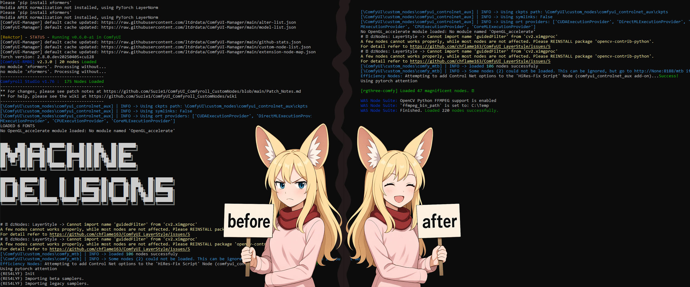

<div align="center">

<h1>ComfyUI-Optim</h1>

<p align="center">
  
</p>
    
</div>


**Tired of your ComfyUI console looking like a rave party of "I'M LOADED!" messages every time it starts? Yeah, me too.**

This little helper, `000_ComfyUI-Optim`, is here to bring some zen to your ComfyUI startup experience. It's like a polite bouncer for your console, gently showing overly chatty custom nodes the "quiet please" sign during their grand entrance.

<p align="center">
  
</p>

## What's the Big Deal? (Features)

*   **Shhh, Nodes are Loading**: Ever felt your eyes glaze over from the endless stream of "Node X Initialized!", "Super Duper Node Now Ready!", "Preparing to Prepare for Loading Node Y!"? This node lets you tell specific custom nodes to, respectfully, *zip it* during their `__init__.py` or main script execution. Your console will thank you.
*   **Configurable Serenity**: A simple `optimizer-config.json` file lets you list exactly which nodes need a gentle reminder about indoor voices. You can also control how much this optimizer itself chats.
    *   Tell specific nodes to be quiet (`modules_to_silence`).
    *   Decide if you want to see what they *would* have said (`log_suppressed_output`).
    *   Adjust how much this optimizer talks (`patcher_log_level`).

*   Also sets `NO_ALBUMENTATIONS_UPDATE=1` to turn off Albumentations notes (if you forgot to do this manually)

## Why "000_"?

This node must be the first in line!

## Installation

Instal via Manager or clone this repository to the `ComfyUI/custom_nodes/000_ComfyUI-Optim`:

```bash
git clone https://github.com/wildminder/000_ComfyUI-Optim.git ComfyUI/custom_nodes/000_ComfyUI-Optim
```

## Configuration (`optimizer-config.json`)

Add nodes name to the config json, something like:

```json
{
  "modules_to_silence": [
"ComfyUI_Fill-Nodes", 
"ComfyUI-Impact-Pack", 
"ComfyUI-Jjk-Nodes", 
"ComfyUI-Logic"
  ],
  "patcher_log_level": "ERROR",
  "log_suppressed_output": false,
  "patcher_debug_mode": false
}
